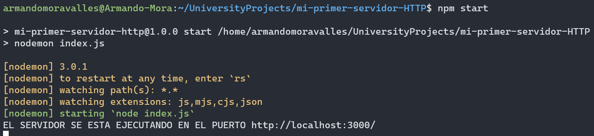
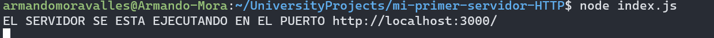

# Mi primer Servidor HTTP

La practica consiste en crear un servidor en node.js en las siguientes etapas:

1. Hola mundo básico.

2. Servidor simple de hola mundo en node.js usando HTTP.

3. Servidor síncrono que lea y envíe un archivo.

4. Servidor asíncrono que lea y envíe un archivo.

5. Servidor asíncrono que lea y envíe un archivo según su extensión.

6. Agregar archivo README.md.

Nota: Cada punto es un commit en el repositorio

## Primeros pasos

Clonar el repositorio

```
git clone <url>
```

Correr el servidor

```
npm start 
```

puedes usar en su lugar: 
```
node index.js
```
pero yo recomendaria usar npm start para hacer uso de nodemon

### Requisitos

Unicamente es necesario contar con NodeJs cualquier version y un navegador

```
node -v
```

### Instalacion

Despues de clonar el repositorio utiliza

```
npm install
```
Para instalar las librerias requeridas, en este caso solo hacemos uso de nodemon y es opcional

End with an example of getting some data out of the system or using it for a little demo

El servidor corriendo con nodemon


El servidor corriendo sin nodemon

## Probar el proyecto

No tenemos test para este proyecto pero utiliza las siguientes url's para probar el funcionamiento

http://localhost:3000/book.txt 
http://localhost:3000/index.html
http://localhost:3000/data.json

### Estilo de codigo
Se utilizo un estilo de codigo por defecto usando camelCase y 2 espacios de identacion

## Deployment

No es requerido un deployment

## Creado con

* [NodeJs](https://nodejs.org/en) - Entorno de ejecucion de JS
* [nodemon](https://www.npmjs.com/package/nodemon/) - paquete de npm para correr el proyecto (opcional)

## versiones

1.0.0

puedes ver cada uno de los puntos de este ejercicio en los commits

## autores

* **Armando Mora Valles** - *Initial work* - [Perfil de GitHub](https://github.com/ArmandoMoraValles)

## Licencia

This project is licensed under the MIT License - see the [LICENSE.md](LICENSE.md) file for details